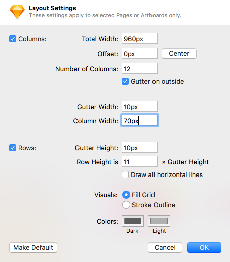
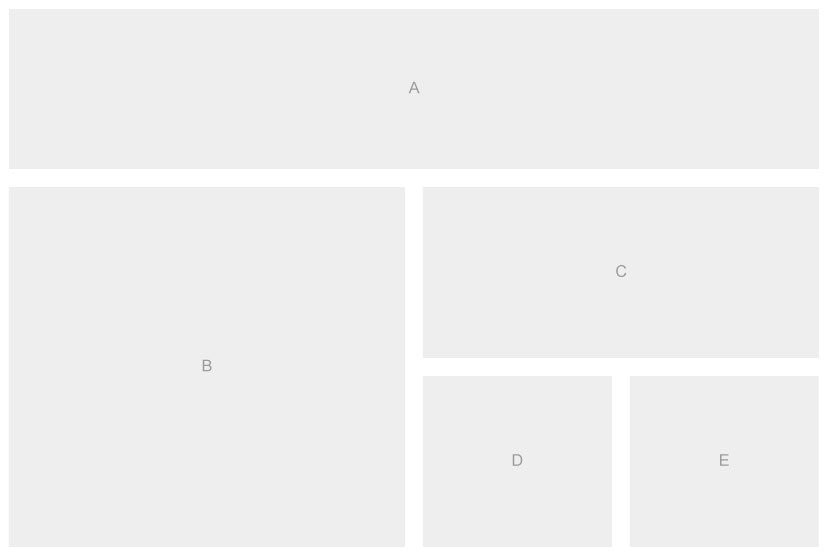
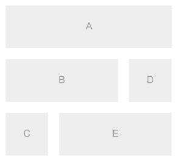

## Depending on your journey as a designer, you may be used to the freedom that graphic media allows: to create overlaps/overlays or to elaborate compositions and grids that fill all the paper with pretty organized photos and texts. However, why is it so hard to build a web page with this same freedom? Fortunately the capacity to build these layouts have been improving and what’s best: it is so simple that you can start using it right now!


### How the web layout works

All the options mentioned above make sense when applied on static medias where all copies will be the same, for example, books and magazines. But on the web things usually work differently: there are infinite device sizes, pages need to load quickly, while being accessible for screen readers and you need the developer’s ability to build everything that was drawn in Sketch or Photoshop, using the minimum possible amount of code so it can be reusable as much as possible.

Having this structure in mind, it is easy to mentally picture the largely-adopted 12/16-column grid in order to build responsive websites and define the transition from desktop to smartphone browsers. However, there are still big limitations (such as the fact that the HTML order directly interferes in the content visualization), resulting in a big and complex amount of code. There are some CSS frameworks that try to solve the grid problem, the most famous are: Bootstrap, Foundation, Flexbox Grid, Lost Grid. But let’s see the written code in these frameworks:

```
<div class="row">
 <div class="col-xs-6">.col-xs-6</div>
 <div class="col-xs-6">.col-xs-6</div>
</div>
<div class="row">
 <div class="col-xs-8">.col-xs-8</div>
 <div class="col-xs-4">.col-xs-4</div>
</div>
<div class="row">
 <div class="col-xs-4">.col-xs-4</div>
 <div class="col-xs-4">.col-xs-4</div>
 <div class="col-xs-4">.col-xs-4</div>
</div>
```

In addition for having to import a considerable amount of code, these structures are usually unreadable and in practice there are always some exceptions that the framework can’t solve. This was a battle won by pure CSS.

### The grid display solution!

The display grid is a [new specification](https://developer.mozilla.org/en-US/docs/Web/CSS/CSS_Grid_Layout) from CSS that drastically reduces the complexity of building web layouts and structures. Now we can divide the page into areas that can be flexible or fixed, which would be filled with content.

Let’s create an of 12-column grid and try to understand what has changed:

```
#container {
  /* 1: Set the width */
  width: 960px;

  /* Invoke the grid */
  display: grid;

  /* 2: Define the columns, in this case 12 columns with liquid width */
  grid-template-columns: repeat(12, 1fr);

  /* Define 8 rows with 110px of height */
  grid-template-rows: repeat(8, 110px);

  /* 3: And the gap width 10px */
  grid-gap: 10px;
}
```](./asset-2.png)

Only by using this **amount of the code**, the elements will already fit inside the grid and will never break or exceed the configured width — a problem that existed on CSS frameworks. And we can still easily get all these values from Sketch.

And the elements from the page are described like this:

```
.box {
  /* Occupy the third to the eleventh column row */
  grid-column: 3/11;

  /* And occupy the region from 1 to 2 line */
  grid-row: 1/2;
}
```

If you wish to learn and understand more about the syntax and distribution options of the elements, I recommend you to read the documentation in [MDN](https://developer.mozilla.org/en-US/docs/Web/CSS/CSS_Grid_Layout) or in [CSS Tricks](https://css-tricks.com/snippets/css/complete-guide-grid/).

### In the Sketch Layout

First you need to allow the layout view in Sketch by using the command “Option + L” and then you just need to configure it on the View > Canvas > Layout Settings. As you can see we use the same values for both CSS and Sketch.



Incredibly simple and beautiful 🙂

### Responsive layout is now fun

Let’s create a classic website as an example, using header, sidebar, article and a footer. Then, we will introduce the concept of grid-area, within the specification of the display grid.

Again, we need to define the columns and rows of the layout, and then we start naming the sections of the page with the grid-area property, so you can **describe** which will be the layout format, like this:

```
.container {
 display: grid;
 grid-template-columns: repeat(3, 1fr);
 grid-template-rows: 100px 400px 100px 100px;
 grid-gap: 10px;

 grid-template-areas: 'header header header'
                      'sidebar article article'
                      'sidebar footer footer';
}

.header { grid-area: header }
.sidebar { grid-area: sidebar }
.article { grid-area: article }
.footer { grid-area: footer }
```](./asset-4.jpeg)

And to change the layout in the mobile you just have to set up the layout, like this:

```
@media screen and (max-width: 768px) {
  .container {
    grid-template-areas: 'header header header'
                         'article article article'
                         'sidebar sidebar sidebar'
                         'footer footer footer';
  }
}
```](./asset-5.jpeg)

As you can see, it doesn’t matter the order or position of HTML, because what really matters is how we set the layout position in CSS.

### What will change in my layout?

You will be able to create more dynamic responsive layouts and with more distinction between desktop and mobile, using elements that could not change positions because of their relation with HTML. Now the elements can be free to occupy areas of the layout that were unreachable before, without repeating code and content (which is bad for SEO and maintenance) and without demanding great efforts.

To make the changes clearer, imagine a desktop layout that looks like this:



On the mobile it can look like this:



Can you see the new possibilities?

### Think outside the grid

There are many possibilities that “display grid” has created, without creating complexities, unreadable codes and upset developers. To see more about these possibilities, I recommend the website [Grid by Example](https://gridbyexample.com/examples/) where it shows the power of this new specification and helps to demonstrate what we can accomplish.

And that changes everything again: since the web’s early days there have been a lot of attempts to write some practical and reusable specifications to build web layouts, from terrible tables, to the floats and now flexbox and grid. Today, the web takes important steps towards friendly code and with possibilities that don’t limit designers and developers’ creativity.

#### **References**

[**Grid by Example - Usage examples of CSS Grid Layout**  
_The following examples include an image of how the example should look in a supporting browser, they each link to a…_gridbyexample.com](https://gridbyexample.com/examples/ "https://gridbyexample.com/examples/")[](https://gridbyexample.com/examples/)

[**Grid layout is a much needed step-change for CSS**  
_The aim of CSS was to separate content and style but our layouts are as tied to our markup as ever. Grid layout has the…_maketea.co.uk](http://maketea.co.uk/2016/09/28/css-grid-layout-is-a-step-change.html "http://maketea.co.uk/2016/09/28/css-grid-layout-is-a-step-change.html")[](http://maketea.co.uk/2016/09/28/css-grid-layout-is-a-step-change.html)

[**fantasai 54: Evolution of CSS Layout: 1990s to the Future**  
_After the conference, PhillyETE posted a screencast of the presentation, so anyone can watch it online. If you're at…_fantasai.inkedblade.net](http://fantasai.inkedblade.net/weblog/2012/css-layout-evolution/ "http://fantasai.inkedblade.net/weblog/2012/css-layout-evolution/")[](http://fantasai.inkedblade.net/weblog/2012/css-layout-evolution/)

[**CSS Grid Layout - creating complex grids**  
_With the Blink and Webkit implementation moving on at great pace, a number of updates to the specification, and Mozilla…_rachelandrew.co.uk](https://rachelandrew.co.uk/archives/2015/02/04/css-grid-layout-creating-complex-grids/ "https://rachelandrew.co.uk/archives/2015/02/04/css-grid-layout-creating-complex-grids/")[](https://rachelandrew.co.uk/archives/2015/02/04/css-grid-layout-creating-complex-grids/)